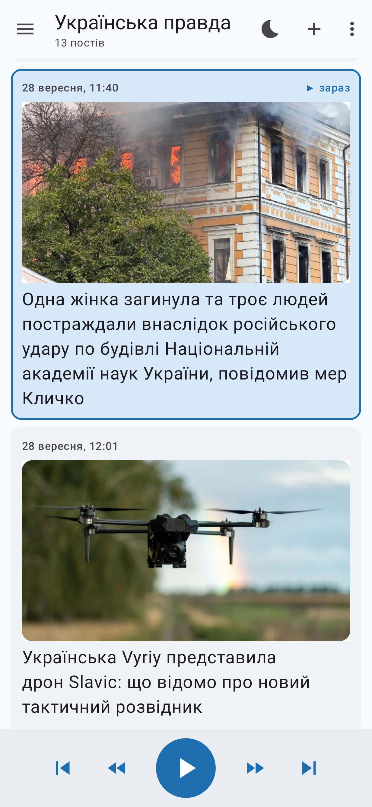
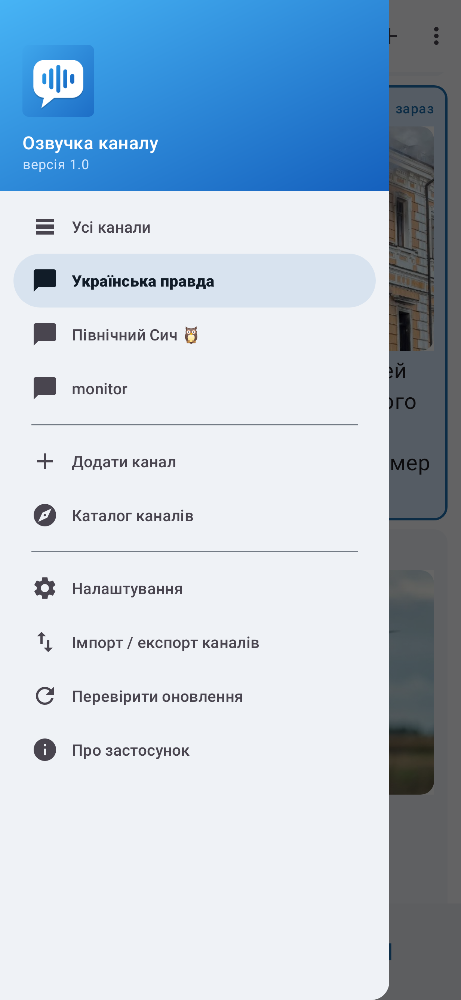
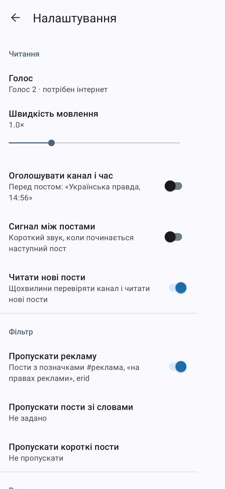
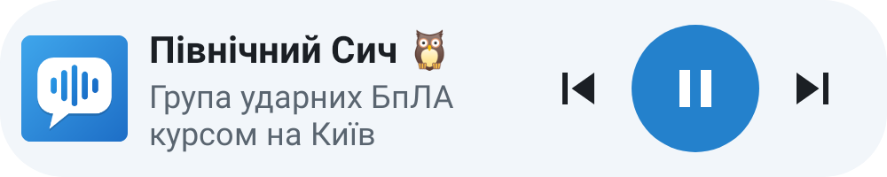

# Озвучка Telegram-каналу

[](https://github.com/Alesko125/tg-channel-reader/releases)
[](https://github.com/Alesko125/tg-channel-reader/releases/latest)

Android-застосунок, який читає вголос пости публічного Telegram-каналу. Вставляєте адресу каналу, натискаєте ▶ і слухаєте, поки руки зайняті.

  



## Можливості

- **Просто вставте адресу**: `@назва`, `t.me/назва` або будь-яке посилання на пост каналу. Можна також натиснути «Поділитися» на каналі в Telegram і вибрати цей застосунок.
- **Бічне меню, як у Telegram**: ваші канали, «Усі канали», каталог, налаштування.
- **Кілька каналів і спільна стрічка**: слухайте один канал або всі разом, по часу. Канал відкривається на найновішому пості.
- **Каталог каналів**: моніторинг загроз (Північний Сич, monitor, єРадар, «Чому тривога», ППО РАДАР…), офіційні канали, новини. Усі адреси перевірені.
- **Читає з вимкненим екраном.** Паузу і перемикання постів можна робити зі шторки сповіщень, з екрана блокування, кнопками навушників і **віджетом** на головному екрані.
- **Таймер сну**: 15 хв – 2 год або «після цього поста».
- **Перемотка по реченнях** всередині поста (⏪ ⏩).
- **Вибір голосу й синтезатора**: одразу звучить приклад. Швидкість від 0,5× до 2,5×.
- **Оголошення каналу й часу** перед постом і **сигнал між постами** (вмикаються в налаштуваннях).
- **Фільтр**: реклама (#реклама, «на правах реклами», erid), ваші слова, короткі пости.
- **Вигляд**: світла чи темна тема, розмір шрифту, компактна панель, фото з постів.
- **Імпорт і експорт** списку каналів: файлом або текстом.
- **Пам'ятає, де ви зупинилися**, і читає нові пости, щойно вони з'являються.
- **Оновлюється сам**, як «Основа 2.0» і «Основа TV»: сповіщення про нову версію та оновлення в один дотик.
- **Без акаунта Telegram і без доступу до ваших переписок.** Застосунок бачить лише те, що будь-хто бачить на сторінці `t.me/s/<канал>` у браузері.

> Моніторингові канали не є офіційним джерелом. Під час тривоги орієнтуйтеся на сирену та офіційні повідомлення.

## Встановлення

1. Відкрийте на телефоні сторінку [**Releases**](https://github.com/Alesko125/tg-channel-reader/releases/latest) і завантажте `TgReader.apk`.
2. Відкрийте файл. Android попросить дозволити встановлення з цього джерела (браузера чи файлового менеджера), дозвольте.
3. Якщо озвучка мовчить або читає з акцентом, встановіть український голос: **Налаштування → Система → Мови → Синтез мовлення → Google (⚙) → Встановити голосові дані → Українська**.

Потрібен Android 8.0 або новіший.

## Обмеження

- Працюють лише **публічні** канали з увімкненим веб-переглядом. Приватні канали й групи так прочитати не можна.
- Озвучується тільки текст. Пости з самими фото чи відео без підпису пропускаються.
- Щоб нові пости читалися з вимкненим екраном, деяким телефонам (Xiaomi, Huawei, Samsung) треба вимкнути оптимізацію батареї для застосунку.

## Для розробників

Kotlin, Android Views і Material 3. Мовлення робить системний `TextToSpeech`, пости беруться з HTML-сторінки `t.me/s/<канал>` через jsoup.

| Файл | Що робить |
|---|---|
| `Telegram.kt` | завантажує і розбирає `t.me/s/<канал>` (текст, фото), ділить текст на фрази |
| `Reader.kt` | канали, спільна стрічка, фільтр, черга читання, TextToSpeech, таймер сну |
| `Settings.kt`, `SettingsActivity.kt` | налаштування і фільтр постів |
| `Catalog.kt` | каталог каналів |
| `MainActivity.kt`, `Dialogs.kt`, `PostAdapter.kt` | інтерфейс, бічне меню, діалоги |
| `PlaybackService.kt`, `PlayerWidget.kt` | фонове читання, сповіщення з кнопками, віджет |
| `update/` | самооновлення з релізів GitHub |

```bash
./gradlew testDebugUnitTest      # тести
./gradlew assembleRelease        # APK → app/build/outputs/apk/release/
RUN_ONLINE_TESTS=1 ./gradlew testDebugUnitTest   # плюс наскрізний тест із живим каналом
```

### Як випустити оновлення

1. Змініть номер у файлі `VERSION` (наприклад, `1.1` → `1.2`) і коротко опишіть зміни в `RELEASE_NOTES.md`.
2. Зробіть push у `main`.

GitHub Actions збере APK, створить реліз `v1.2` і додасть до нього `TgReader.apk` та `version.json`. Встановлені застосунки читають `releases/latest/download/version.json`, тож про нову версію дізнаються самі. Пуші без зміни `VERSION` лише збирають і перевіряють APK, реліз при цьому не створюється.

APK підписується відкритим ключем `app/shared-debug.keystore` з репозиторію, тому кожна нова збірка ставиться поверх старої.
Щоб підписувати власним приватним ключем, додайте в секрети репозиторію `SIGNING_KEYSTORE_BASE64`, `SIGNING_STORE_PASSWORD`, `SIGNING_KEY_ALIAS` і `SIGNING_KEY_PASSWORD`.
Зверніть увагу: після зміни ключа застосунок доведеться один раз перевстановити.

### Скільки разів завантажили

Лічильник угорі рахує завантаження `TgReader.apk` з усіх релізів. Сюди входять і перші встановлення, і оновлення з самого застосунку. Детально по версіях:

```bash
curl -s https://api.github.com/repos/Alesko125/tg-channel-reader/releases \
  | jq -r '.[] | .tag_name as $t | .assets[] | select(.name=="TgReader.apk") | "\($t): \(.download_count)"'
```
